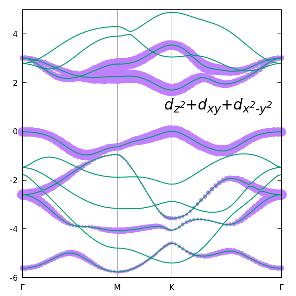

# Plot fat bands for Mo d orbitals

Run QE calculations:

> pw.x < scf.in  > scf.out

> pw.x < bands.in > bands.out

> bands.x < bandsx.in > bandsx.out

> projwfc.x < projwfc.in > projwfc.out

Then run Python script

> python3 read_fatbands.py projwfc.out --eref -0.9612 -o fatbands.dat

Plot the results 

> gnuplot plot_fat_bands_z2_xy_x2_y2.gnu

 
